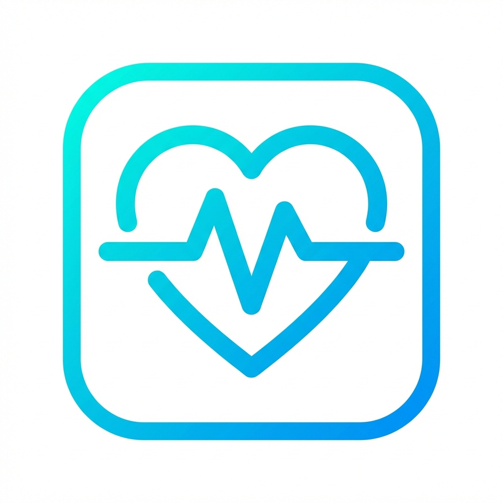

<p align="center">
  
</p>

<h1 align="center">HealthCarePlus</h1>

<p align="center">
  <strong>Your Personalized Healthcare Companion</strong>
</p>

<p align="center">
  <a href="#features">Features</a> •
  <a href="#demo">Demo</a> •
  <a href="#tech-stack">Tech Stack</a> •
  <a href="#getting-started">Getting Started</a> •
  <a href="#deployment">Deployment</a>
</p>

<p align="center">
  
  
  
  
</p>

---

## 📖 About The Project

**HealthCarePlus** is a comprehensive **Personalized Healthcare Reminder & Preventive Care System** designed to help users take control of their health through smart technology.

### The Problem
- People often forget medications, hydration, and health check-ups
- Lack of visual feedback on health progress
- Disconnected health data without actionable insights

### Our Solution
A beautiful, modern web application that provides:
- **Smart Reminders** - Never miss a dose or appointment
- **Visual Health Tracking** - Interactive body visualization with real-time metrics
- **AI-Powered Insights** - Personalized recommendations based on your health data
- **Preventive Care** - Proactive suggestions to maintain optimal health

### Key Highlights
- 🎨 Premium UI with glassmorphism effects and smooth animations
- 🌓 Dark/Light mode for comfortable viewing
- 📱 Fully responsive design (mobile, tablet, desktop)
- 🔒 Secure authentication with NextAuth.js
- ⚡ Built with Next.js 16 for optimal performance

---

## ✨ Features

| Feature | Description |
|---------|-------------|
| 🏠 **Dashboard** | Real-time health metrics, reminders, and weekly progress |
| 💊 **Smart Reminders** | Medication, hydration, and activity scheduling |
| 📊 **Health Insights** | Weekly charts with AI-powered recommendations |
| 🧍 **Body Status** | Interactive 2D body visualization with health indicators |
| 🌓 **Dark/Light Mode** | System-wide theme toggle with localStorage persistence |
| 📱 **Responsive** | Works on desktop, tablet, and mobile devices |

---

## 🎨 Demo

### Landing Page


### Health Insights Dashboard


---

## 🛠 Tech Stack

- **Framework**: [Next.js 16](https://nextjs.org/) (App Router)
- **Styling**: [Tailwind CSS 4](https://tailwindcss.com/)
- **Animation**: [Framer Motion](https://www.framer.com/motion/)
- **3D Graphics**: [Three.js](https://threejs.org/) + React Three Fiber
- **Database**: [Prisma](https://www.prisma.io/) + SQLite
- **Auth**: [NextAuth.js](https://next-auth.js.org/)
- **Icons**: [Lucide React](https://lucide.dev/)

---

## 🚀 Getting Started

### Prerequisites

- Node.js 18+
- npm or yarn

### Installation

```bash
# Clone the repository
git clone https://github.com/singhcod3r/HealthCare_Final_year.git
cd HealthCare_Final_year/web

# Install dependencies
npm install

# Generate Prisma client
npx prisma generate

# Push database schema
npx prisma db push

# Start development server
npm run dev
```

Open [http://localhost:3000](http://localhost:3000) in your browser.

---

## 📁 Project Structure

```
web/
├── app/
│   ├── (dashboard)/      # Protected routes
│   │   ├── dashboard/
│   │   ├── reminders/
│   │   ├── insights/
│   │   ├── body-status/
│   │   └── profile/
│   ├── (public)/         # Auth pages
│   │   ├── signin/
│   │   └── signup/
│   └── api/              # API routes
├── components/           # React components
├── lib/                  # Utilities (auth, prisma)
├── prisma/               # Database schema
└── public/               # Static assets
```

---

## 🌐 Deployment

### Vercel (Recommended)

1. Push to GitHub
2. Import project in [Vercel](https://vercel.com)
3. Set root directory to `web`
4. Add environment variables:

| Variable | Value |
|----------|-------|
| `DATABASE_URL` | Your database connection string |
| `NEXTAUTH_SECRET` | Random secret key |
| `NEXTAUTH_URL` | Your production URL |

> ⚠️ For production, use a cloud database (Vercel Postgres, Supabase, PlanetScale)

---

## 🔗 Links

- **Twitter**: [@singhcod3r](https://x.com/singhcod3r)
- **GitHub**: [singhcod3r](https://github.com/singhcod3r)
- **LinkedIn**: [singhcod3r](https://linkedin.com/in/singhcod3r)

---

## 📄 License

MIT License - feel free to use this project for personal or commercial purposes.

---

<p align="center">
  Made with ❤️ for better health
</p>
